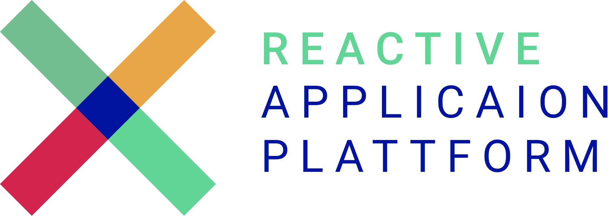

> Reactive Application Platform, or RxAP for short, is a collection of software modules and tools. With the help of RxAP, the development effort of web and cloud applications can be significantly reduced.

# Projects

Name | License | Version | Dependencies | Description
--- | --- | --- | --- | ---
@rxap/browser-tailwind |  |  |  | Provides a Tailwind CSS configuration with RXAP-specific theme extensions, including custom color palettes and font families. It also includes an init generator that adds missing peer dependencies to the project&#x27;s package.json and runs init generators for those dependencies.
@rxap/browser-utilities |  |  |  | Provides browser utilities such as clicking on a link programmatically and observing the height of an element. Includes functionality to handle peer dependencies within an Nx workspace. It also includes an init generator to add missing peer dependencies to package.json.
@rxap/fs |  |  |  | @rxap/json-schema-to-typescript |  |  |  | Generate TypeScript interfaces from JSON Schema definitions. It allows you to programmatically create and manipulate TypeScript interface definitions based on JSON schema inputs. The package provides utilities to convert JSON schema to TypeScript interfaces, handle references, and manage imports.
@rxap/mixin |  |  |  | Provides decorators and utilities for applying the mixin pattern in TypeScript. It allows you to compose classes by combining properties and methods from multiple sources. This library includes features for overwriting properties and handling metadata during the mixin process.
@rxap/n8n-nodes-cache |  |  |  | This package provides a cache node for n8n workflows, allowing users to cache items using a MinIO client. It supports both reading from and writing to the cache, with options to disable caching and configure bucket names and keys. The node can improve workflow performance by storing and retrieving data from a cache instead of re-executing expensive operations.
@rxap/n8n-nodes-cqrs |  |  |  | This package provides base classes for creating n8n nodes that interact with RabbitMQ using the CQRS pattern. It includes nodes for sending commands, queries, and events, as well as trigger nodes for listening to specific patterns. The nodes are configured using JSON schemas to define the available operations and payload structures.
@rxap/n8n-nodes-development |  |  |  | Provides development trigger nodes for n8n workflows, including a manual trigger and a workflow execution trigger. These nodes are designed to help with designing modular, microservice-like workflows and for testing workflows with specified input data.
@rxap/n8n-nodes-file |  |  |  | This package provides an n8n node to calculate the hash of a file. It supports various hash algorithms like SHA-256, MD5, and SHA-1. The node takes a binary file as input and outputs the calculated hash value.
@rxap/n8n-nodes-firecrawl |  |  |  | @rxap/n8n-nodes-ipfs |  |  |  | An n8n node to download files from IPFS, supporting download as file, JSON, or text, with options for specifying the IPFS gateway, CID, and file path. It allows users to retrieve content from IPFS and integrate it into their n8n workflows.
@rxap/n8n-nodes-neo4j |  |  |  | Provides a Neo4j node for n8n workflows, including basic authentication credentials. It allows to connect and interact with Neo4j databases within the n8n automation platform. Includes an init generator to handle peer dependencies.
@rxap/n8n-nodes-open-webui |  |  |  | This package provides an n8n node for interacting with the Open Web UI. It leverages the &#x60;@rxap/n8n-utilities&#x60; package and an OpenAPI definition to simplify the integration. The node allows users to connect and utilize the functionalities exposed by the Open Web UI.
@rxap/n8n-nodes-sanitize-html |  |  |  | Sanitizes HTML content based on specified rules, allowing you to control which tags and attributes are permitted. This package provides a node for n8n that transforms HTML by removing potentially harmful or unwanted elements. It helps ensure that the HTML is safe and conforms to your desired standards.
@rxap/n8n-nodes-yaml |  |  |  | This n8n node allows you to convert data to and from YAML format. It supports operations like extracting data from YAML, converting to YAML, and setting values within YAML structures. It also includes utilities for handling binary data and different encoding options.
@rxap/n8n-nodes-zip |  |  |  | This n8n node package provides functionality to interact with zip files, specifically to extract them. It allows users to extract zip files from a binary property and make the extracted files available as binary data in subsequent nodes.
@rxap/n8n-utilities |  |  |  | This package provides utility functions and classes for n8n nodes, including custom authentication methods (Bearer Auth, Oauth2 Proxy Auth, Base URL), a decorator for capturing execution errors, and base classes for creating nodes from OpenAPI specifications. It simplifies the process of building and integrating with REST APIs within the n8n workflow automation platform. The package offers tools for defining node properties based on OpenAPI schemas and handling different request body types.
@rxap/pattern |  |  |  | Provides interfaces and types for implementing common patterns like commands, data sources, and methods with metadata. It offers a structured approach to defining and interacting with data and actions in a consistent manner. The package also includes an init generator for managing peer dependencies in a workspace.
@rxap/reflect-metadata |  |  |  | Provides utilities for working with Reflect Metadata. It includes functions for setting, getting, and manipulating metadata on objects and properties. This package also offers functionalities for change detection using proxies and metadata.
@rxap/rxjs |  |  |  | This package provides a set of RxJS operators and utilities. It includes operators for property checking, deep equality comparison, value definition, and logging, as well as utilities for managing subscriptions, toggling boolean values, and handling request progress. It also contains a button definition interface.
@rxap/slugify |  |  |  | A utility for creating slugified strings from input strings. It provides options for customizing the replacement character, removing unwanted characters, lowercasing, strict mode, locale-specific replacements, and adding a random suffix. The package includes a class and a function for easy use.
@rxap/ts-morph |  |  |  | Provides utilities for manipulating TypeScript code using the ts-morph library. It offers a fluent API to add, modify, and remove code elements such as classes, decorators, imports, and properties in both Angular and NestJS projects. This package simplifies common code generation and refactoring tasks.
@rxap/utilities |  |  |  | A collection of utility functions, types and interfaces.@rxap/validator |  |  |  | @rxap/workspace-cypress |  |  |  | This package provides custom Cypress commands for Angular Material components, particularly for interacting with form fields and handling errors. It also includes an init generator that manages peer dependencies and runs init generators for those dependencies. The package aims to simplify testing Angular Material-based applications with Cypress.
@rxap/workspace-open-api |  |  |  | This package provides utilities and generators for working with OpenAPI specifications in a workspace. It includes functionality for generating TypeScript interfaces, data sources, directives, remote methods, and operation commands based on an OpenAPI schema. The package also offers tools for loading OpenAPI configurations and resolving references within the schema.
@rxap/workspace-ts-morph |  |  |  | This package provides utilities for transforming workspace files using the TypeScript compiler API via ts-morph. It includes functions to add directories to a ts-morph project, apply ts-morph project changes to a tree, and perform transformations on Angular and Nest projects. The package also offers an init generator for adding peer dependencies to a project.
@rxap/workspace-utilities |  |  |  | Provides utilities for Nx workspaces, including file manipulation, project configuration, and code generation. It offers tools for reading, updating, and managing workspace files like &#x60;package.json&#x60;, &#x60;nx.json&#x60;, and &#x60;tsconfig.json&#x60;, as well as functionalities for project-related tasks such as determining project types, dependencies, and build outputs. This package simplifies common workspace operations and enhances developer productivity.
@rxap/xml-parser |  |  |  | Provides a set of decorators and services for parsing and serializing XML documents into TypeScript classes. It simplifies the process of mapping XML elements and attributes to class properties, handling data validation, and serializing objects back into XML. The library supports defining XML structures using decorators and offers a flexible way to customize parsing and serialization logic.

## Angular
Name | License | Version | Dependencies | Description
--- | --- | --- | --- | ---
@rxap/authentication |  |  |  | Provides authentication services, guards, and interceptors for Angular applications. It supports token-based authentication and provides features such as sign-out functionality and routing based on authentication status. This package also includes utilities for disabling authentication in certain environments and managing access tokens.
@rxap/authorization |  |  |  | Provides an Angular module and directives to manage authorization and permissions in your application. It allows you to control the visibility and enabled state of UI elements based on user permissions. The package includes an &#x60;AuthorizationService&#x60; to check permissions and directives to easily integrate permission checks into your templates and components.
@rxap/components |  |  |  | This package provides a set of reusable Angular components, including a navigate back button, a JSON viewer, an empty router outlet, a copy-to-clipboard button and component, and a confirmation dialog with directive and module. These components are designed to simplify common UI tasks and improve the user experience in Angular applications. The package also includes an init generator for use with Nx workspaces.
@rxap/config |  |  |  | Provides a configuration service for Angular applications, allowing you to load and manage application settings from various sources such as static files, URLs, local storage, and URL parameters. It supports schema validation and provides utilities for accessing configuration values. This package also includes testing utilities for mocking and managing configurations in test environments.
@rxap/contenteditable |  |  |  | Provides an Angular directive to make any element contenteditable. It supports change detection and debouncing, and allows binding to a method for handling content changes. The package also includes an init generator for managing peer dependencies.
@rxap/data-grid |  |  |  | Provides a data grid component for Angular applications. It supports plain and form modes, custom header and cell templates, and integration with Rxap Forms and Data Sources. The component allows for displaying and editing data in a tabular format with features like edit mode, validation, and data refresh.
@rxap/data-source |  |  |  | Provides a set of classes and decorators for creating and managing data sources in Angular applications, including base classes, static data sources, observable data sources, and method data sources. It also includes a component for displaying data source errors. The library offers features like data persistence, refresh and retry mechanisms, and integration with RxJS observables.
@rxap/definition |  |  |  | Provides a base definition class and related utilities for managing and loading definitions in Angular applications. It includes metadata handling, dependency injection support, and lifecycle management for definitions. This package simplifies the creation and management of configurable and extensible application components.
@rxap/dialog |  |  |  | This package provides Angular Material-based message and confirm dialog components and services. It offers customizable dialogs for displaying messages and confirmations to users. The package includes components for rendering the dialogs and services for easily opening them with configurable options.
@rxap/directives |  |  |  | This package provides a set of Angular directives to simplify common tasks such as setting background images, confirming clicks, making elements contenteditable, and more. It includes directives for handling UI interactions, applying styles, and managing asynchronous operations. These directives aim to reduce boilerplate code and improve the reusability of components in Angular applications.
@rxap/environment |  |  |  | Provides utilities and components for managing application environments in Angular, including determining environment names, release versions, and providing environment-specific configurations. It offers a component to display environment information and functions to update the environment with build details. The package also includes an init generator for setting up peer dependencies.
@rxap/firebase |  |  |  | This package provides Angular modules and services to integrate with Firebase, including App Check, Messaging, and Storage. It offers providers for configuring Firebase options and emulators, as well as an HTTP interceptor for App Check. The package also includes utilities for requesting cloud messaging tokens and displaying notifications.
@rxap/form-system |  |  |  | This package provides a set of directives, decorators, mixins, and validators to simplify the creation of dynamic forms in Angular applications. It offers features such as automatic control creation, data source integration, component customization, and hide/show logic based on form state. The library aims to streamline form development by providing reusable components and abstractions for common form-related tasks.
@rxap/form-window-system |  |  |  | Provides directives and services to simplify opening forms in windows within an Angular application. It includes features for submitting forms, managing window footers, and opening forms using methods. This package integrates with @rxap/forms and @rxap/window-system to streamline form-based workflows in a windowed environment.
@rxap/forms |  |  |  | This package provides a set of tools and directives to simplify working with Angular forms, including reactive forms, custom validators, and form directives for handling loading, submitting, and error states. It offers decorators for defining forms and controls, along with utilities for building complex forms with nested groups and arrays. The library aims to enhance the development experience by providing a more structured and maintainable approach to form management in Angular applications.
@rxap/handlebars |  |  |  | Provides an Angular pipe that compiles Handlebars templates.  The pipe takes a template string and a context object as input. It then uses Handlebars to compile the template with the provided context, returning the rendered string.
@rxap/icon |  |  |  | This package provides an Angular module to load SVG icons from specified asset paths using the Angular Material Icon Registry. It simplifies the process of registering and using custom icons in Angular applications. The module allows configuring the icon asset paths and automatically loads the icon sets during initialization.
@rxap/keycloak |  |  |  | This package provides an Angular service and interceptor to simplify integration with Keycloak, an open-source identity and access management solution. It offers features such as authentication, authorization, token management, and automatic bearer token injection for HTTP requests. The package also includes an authentication guard for Angular routes.
@rxap/layout |  |  |  | This library provides a set of Angular components and services for creating consistent and configurable application layouts, including headers, footers, side navigation, and content areas. It offers features such as dynamic navigation, external application integration, and customizable themes. The library also includes directives for extending header and footer areas with custom content.
@rxap/life-cycle |  |  |  | Provides an Angular service and guard to manage application lifecycle. It allows to execute code when the application is stable and ready. Includes a guard to prevent route activation until the app is ready.
@rxap/ngx-bootstrap |  |  |  | Provides base classes and utilities for bootstrapping Angular applications, including module-based and standalone components, with configuration loading and environment management. It offers abstractions for common setup tasks, such as dynamic module federation and environment updates. This package simplifies the initialization process for Angular projects.
@rxap/ngx-changelog |  |  |  | This package provides Angular components and services to display changelogs within an application. It fetches changelog data from a remote source and presents it in a user-friendly dialog or component, allowing users to view updates and changes. The package also includes features to remember the last viewed version and disable the changelog display.
@rxap/ngx-error |  |  |  | This package provides a comprehensive error handling solution for Angular applications, including interceptors, services, and UI components to display different types of errors in a user-friendly dialog. It supports handling of generic errors, HTTP errors with messages or codes, and OpenAPI HTTP response errors, with customizable options for logging, displaying dialogs, and integrating with Sentry. The package aims to simplify error management and improve the user experience by providing clear and informative error messages.
@rxap/ngx-localize |  |  |  | This package provides internationalization (i18n) support for Angular applications, including services for language management, an HTTP interceptor for setting the &#x60;Accept-Language&#x60; header, and a language selector component. It allows you to set and manage the current language of your application, redirect users based on their language preference, and configure available languages. The package also includes an init generator to handle peer dependencies.
@rxap/ngx-marker-io |  |  |  | This package provides an Angular service to integrate with marker.io, a visual feedback and bug reporting tool. It allows you to easily load the marker.io widget, set custom data, and manage reporter information within your Angular application. The package also includes an init generator for setting up peer dependencies.
@rxap/ngx-memory |  |  |  | This package provides Angular services and decorators for interacting with web storage (localStorage and sessionStorage) and in-memory storage. It offers a simple way to manage data persistence with expiration options and provides decorators for binding class properties directly to storage values. The package includes services for local storage, session storage, and ephemeral (in-memory) storage.
@rxap/ngx-oauth2-proxy |  |  |  | Provides an Angular guard and utilities for integrating with an OAuth2 Proxy. It includes a guard to protect routes, a method to fetch user profile information, and a data source for managing the user profile. Also provides an app initializer to subscribe to logout events.
@rxap/ngx-pub-sub |  |  |  | Provides a simple publish/subscribe service for Angular applications. It supports caching of messages with optional retention policies and a garbage collector to manage the cache size.  The service also supports wildcard topic matching.
@rxap/ngx-sentry |  |  |  | This package provides utilities for initializing Sentry in Angular applications. It includes functions to determine the Sentry environment and release based on the application&#x27;s environment, and a function to initialize Sentry with these configurations. It also includes a generator to add peer dependencies to the package.json.
@rxap/ngx-status-check |  |  |  | This package provides Angular components and services to check and display the status of various services. It includes a status indicator component, a status check component, a service to retrieve status information, and a guard to protect routes based on service status. It also provides utilities for configuring status check intervals and integrating with OpenAPI.
@rxap/ngx-theme |  |  |  | This package provides an Angular theme service that allows you to manage and customize the look and feel of your application. It includes features such as dark mode support, theme density control, typography settings, and color palette management. The service also provides utilities for computing color palettes and observing theme density changes.
@rxap/ngx-timeago |  |  |  | This package provides Angular pipes and a directive for displaying dates and times in a human-readable &quot;time ago&quot; format. It includes a live pipe that updates automatically. The package also offers a formatter for converting dates into time ago strings.
@rxap/ngx-user |  |  |  | Provides Angular services and data sources for managing user settings such as dark mode, language, and theme preferences. It uses Rxap data sources and Open API remote methods to interact with a user settings API. The package also includes components and utilities for managing theme density and typography.
@rxap/oauth |  |  |  | This package provides an authentication guard and service for Angular applications using OAuth 2.0 and OpenID Connect. It simplifies the integration of authentication flows, including sign-in, sign-out, and token management, with support for disabled authentication scenarios. The package also includes a provider function to streamline configuration.
@rxap/open-api |  |  |  | This package provides tools for working with OpenAPI specifications in Angular applications. It includes services for configuring and loading OpenAPI definitions, validating requests and responses against schemas, and handling errors. It also offers utilities for building HTTP requests based on OpenAPI definitions.
@rxap/pipes |  |  |  | Provides a set of Angular pipes for common data transformations, including currency formatting, string manipulation, and object property access. These pipes offer standalone functionality for easy integration into Angular templates. The package includes pipes for escaping quotation marks, joining arrays, limiting array length, replacing substrings, slicing arrays, truncating strings, and deleting identifier properties from objects.
@rxap/remote-method |  |  |  | This package provides abstractions for defining and executing remote methods in Angular applications. It includes features such as automatic refreshing, proxying, and error handling. It offers a structured way to manage remote calls and their dependencies.
@rxap/service-worker |  |  |  | Provides services and components to simplify the management of service worker updates in Angular applications. It includes features such as automatic updates, dialog prompts for updates, and logging of update events. The package also offers utilities to unregister service workers and initialize peer dependencies.
@rxap/services |  |  |  | Provides Angular services for common tasks such as loading images, managing loading indicators, resetting data, and managing components in a window container sidenav. It also includes a service to generate avatar images. This package offers reusable services to simplify development in Angular applications.
@rxap/socket-io |  |  |  | Provides Angular providers for integrating Socket.IO client functionality. It simplifies the configuration and injection of a Socket.IO client instance using tokens and dynamic configuration options. This package allows you to easily connect to a Socket.IO server within your Angular application.
@rxap/table-system |  |  |  | This package provides a set of Angular directives, components, and services to enhance data tables with features like row expansion, full-text search, and row selection with checkboxes. It includes modules for easy integration of these features into existing Angular Material tables. The package offers components for controlling row expansion, displaying checkbox-based row selection, and filtering table data using full-text search.
@rxap/tree |  |  |  | This package provides a tree component and data source for Angular applications. It includes features such as searching, filtering, and displaying hierarchical data. The package also offers directives for customizing the content of tree nodes.
@rxap/upload |  |  |  | A Material Design upload button component for Angular that supports file selection, display, and download. It integrates with Angular Forms and provides visual feedback. It also includes a pipe to read files as data URLs.
@rxap/window-system |  |  |  | A module for creating and managing windows within an Angular application. It provides components for window containers, toolbars, resizers, action bars, and task bars, along with services for managing window instances and configurations. This library allows developers to create a desktop-like experience within their web applications.

## Angular Material
Name | License | Version | Dependencies | Description
--- | --- | --- | --- | ---
@rxap/material-directives |  |  |  | This package coerces peer dependencies for &#x60;@rxap&#x60; packages, ensuring they are correctly installed in the project. It also runs init generators for peer dependencies that have them. It can also move the package from devDependencies to dependencies or vice versa based on the package name.
@rxap/material-form-system |  |  |  | Provides directives and a module to enhance Angular Material forms. It includes features such as displaying control errors, clearing input fields, handling required fields, and managing form field visibility based on defined conditions. The package also offers a form controls component with built-in reset, cancel, and submit functionalities.
@rxap/material-table-system |  |  |  | This package provides a set of Angular directives, components, and services to enhance and customize Angular Material tables. It includes features such as row selection, column filtering, expandable rows, table actions, and more. The goal is to simplify common table-related tasks and provide a more flexible and feature-rich table experience.
@rxap/material-table-window-system |  |  |  | Provides a directive and service to open a table select component in a window. This package allows users to select rows from a table within a window and return the selected data. It integrates with &#x60;@rxap/material-table-system&#x60; and &#x60;@rxap/window-system&#x60; for displaying and managing the table selection in a window.
@rxap/ngx-material-authentication |  |  |  | This package provides Angular Material components and services for user authentication, including login, reset password, and loading functionalities. It offers pre-built forms, methods, and UI components to streamline the implementation of authentication flows in Angular applications. The package also includes an authentication container component and route configurations for easy integration.
@rxap/ngx-material-localize |  |  |  | Provides components and services to simplify internationalization (i18n) in Angular Material applications. It offers components for language selection and utilities to localize Material components like Datepicker, Paginator and Stepper. This package aims to streamline the process of adapting your Angular Material UI to different languages.
@rxap/ngx-material-table-select |  |  |  | Provides components and directives to integrate a table selection window into Angular Material forms. It includes features for data binding, filtering, and display customization, making it easier to select data from a table within a form context. This package also offers decorators and mixins to streamline the configuration and extraction of data for table selection.

## Data Structure
Name | License | Version | Dependencies | Description
--- | --- | --- | --- | ---
@rxap/data-structure-tree |  |  |  | Provides a tree data structure with node manipulation capabilities, including adding, removing, and traversing nodes.  It supports hierarchical data representation with features like expanding, collapsing, selecting, and deselecting nodes.  The package also includes utilities for managing node visibility and custom parameters.

## NestJS
Name | License | Version | Dependencies | Description
--- | --- | --- | --- | ---
@rxap/nest-auth0 |  |  |  | This package provides an Auth0 module for NestJS applications, simplifying integration with Auth0 for authentication and authorization. It includes a configurable module, JWT strategy, and service for interacting with the Auth0 Authentication API. The module also offers validation schemas for environment variables related to Auth0 configuration.
@rxap/nest-dto |  |  |  | This package provides a set of reusable DTOs (Data Transfer Objects) and utilities for NestJS applications, leveraging class-transformer and class-validator for data validation and transformation. It includes base DTOs for common use cases like UUIDs, icons, and paginated data, along with options for configuring class-transformer and class-validator. It also offers a utility function to easily create DTO instances from plain objects with validation.
@rxap/nest-firebase |  |  |  | This package provides Firebase integration for NestJS applications. It includes modules, guards, and decorators for Firebase Authentication and App Check, as well as utilities for Firestore error handling. It simplifies the process of securing and managing Firebase-related functionalities within a NestJS application.
@rxap/nest-jwt |  |  |  | This package provides a set of NestJS utilities for JWT (JSON Web Token) authentication and authorization. It includes guards, decorators, and a module options loader to simplify the integration of JWT-based security in NestJS applications. It allows you to easily protect your API endpoints and manage user permissions.
@rxap/nest-keyv-minio |  |  |  | A NestJS cache module that utilizes MinIO as a storage adapter for Keyv. It provides a simple way to integrate MinIO with NestJS caching, allowing you to store cached data in a MinIO bucket. This package includes a Keyv adapter and a module options factory for easy configuration.
@rxap/nest-logger |  |  |  | A NestJS logger module that integrates with Google Cloud Logging and provides enhanced message formatting. It allows for custom print message functions and circular dependency handling. This package offers a convenient way to standardize and enrich logging within NestJS applications.
@rxap/nest-minio |  |  |  | NestJS module for integrating with Minio object storage. It provides a service for interacting with Minio, a configurable module builder, and a health indicator for monitoring Minio&#x27;s status. The module also includes options loader for configuration.
@rxap/nest-oauth2-proxy |  |  |  | Provides NestJS decorators to extract authentication information from request headers set by an OAuth2 proxy. Includes decorators for accessing the access token, email, groups, preferred username, and user ID. Also includes a generator for initializing the package.
@rxap/nest-open-api |  |  |  | This package provides tools and utilities for integrating OpenAPI specifications into NestJS applications. It includes features for handling upstream API requests, managing server configurations, and generating OpenAPI documentation. It also offers interceptors and exception filters for enhanced request handling and validation.
@rxap/nest-openfga |  |  |  | A NestJS module for integrating with OpenFGA, a fine-grained authorization service. It provides a service, guard, and decorator to simplify authorization logic within NestJS applications. The module allows you to define authorization rules and enforce them using OpenFGA.
@rxap/nest-rabbitmq |  |  |  | This package provides a NestJS module for integrating with RabbitMQ using exchanges. It offers a client and server implementation for message queuing and supports features like health checks and error serialization. It simplifies the process of setting up and managing RabbitMQ connections and message handling within NestJS applications.
@rxap/nest-rabbitmq-vault |  |  |  | This package provides a NestJS module that integrates with HashiCorp Vault to retrieve RabbitMQ credentials. It allows applications to dynamically fetch usernames and passwords for RabbitMQ from Vault, enhancing security and simplifying credential management. The module also supports automatic lease renewal for the Vault credentials.
@rxap/nest-sentry |  |  |  | This package provides a Sentry integration for NestJS applications. It includes a logger, interceptor, and module to simplify error tracking and performance monitoring with Sentry. It offers configurable options for setting up Sentry in your NestJS application.
@rxap/nest-server |  |  |  | Provides a set of utilities and base classes for building NestJS servers, including monolithic, microservice, and hybrid applications. It offers features such as environment configuration, logger integration, and setup for common middleware like cookie parsing, CORS, and Swagger. This package aims to streamline the process of setting up and configuring NestJS applications for various deployment scenarios.
@rxap/nest-socket-io-client |  |  |  | This package provides a NestJS module for integrating a Socket.IO client. It offers a client proxy service and a provider for managing the Socket.IO client connection, allowing NestJS applications to easily interact with Socket.IO servers.
@rxap/nest-supabase |  |  |  | This package provides a NestJS module for integrating with Supabase. It offers a configurable module with options for setting the Supabase URL and key, and a service for interacting with the Supabase client. The module also includes an options loader for retrieving configuration from NestJS ConfigService.
@rxap/nest-testing |  |  |  | Provides factories for creating mock config services and loggers, useful for testing NestJS applications. Includes a MockConfigServiceFactory to generate config service mocks and a MockLoggerFactory for logger mocks. Also includes an init generator for adding peer dependencies to a project.
@rxap/nest-utilities |  |  |  | Provides utility functions, pipes, interceptors, modules, and configuration options to enhance NestJS applications. It includes features for filtering, sorting, paging, environment configuration, validation, logging, and more. This package aims to simplify common tasks and promote best practices in NestJS development.
@rxap/nest-vault |  |  |  | A NestJS module for integrating with HashiCorp Vault. It provides a VaultService for interacting with the Vault API, including authentication, reading, writing, and managing secrets. It supports token-based and Kubernetes authentication methods, along with health checks to ensure Vault connectivity.
@rxap/nest-web3-storage |  |  |  | NestJS module for interacting with web3.storage. It provides a service for uploading and retrieving data from the decentralized web using the web3.storage service. The module can be configured using the NestJS config service.

## Node
Name | License | Version | Dependencies | Description
--- | --- | --- | --- | ---
@rxap/node-local-storage |  |  |  | Provides a simple local storage implementation for Node.js environments, persisting data to a specified directory. It implements the standard &#x60;Storage&#x60; interface, allowing for easy data storage and retrieval. This package is useful for applications that need a persistent storage mechanism without relying on a database.
@rxap/node-utilities |  |  |  | Provides a set of utility functions for Node.js development, including file system operations, git integration, and package.json manipulation. It offers functionalities like copying folders, reading JSON files with retry logic, retrieving the current git branch, and fetching package information from npm. This package aims to simplify common tasks and improve developer productivity in Node.js projects.

## NX Generator
Name | License | Version | Dependencies | Description
--- | --- | --- | --- | ---
@rxap/generator-ts-morph |  |  |  | This package provides a deprecated &#x60;AddDir&#x60; export, which is now recommended to be imported from &#x60;@rxap/workspace-ts-morph&#x60;. It also includes an init generator that helps manage peer dependencies for other &#x60;@rxap&#x60; packages, ensuring they are correctly added to either &#x60;dependencies&#x60; or &#x60;devDependencies&#x60; in the project&#x27;s &#x60;package.json&#x60;. The generator also attempts to run the init generator of the peer dependencies.
@rxap/generator-utilities |  |  |  | This package provides utilities for Nx generators, specifically to handle peer dependencies. It helps to coerce peer dependencies for other packages, ensuring they are correctly installed and configured. It also runs init generators for peer dependencies.

## NX Plugin
Name | License | Version | Dependencies | Description
--- | --- | --- | --- | ---
@rxap/plugin-angular |  |  |  | This package provides generators and executors for Angular projects within an Nx workspace. It helps initialize and configure Angular applications and libraries with Rxap-specific defaults and utilities. It also includes executors for tasks like checking ng-package configurations, managing application configurations, and generating i18n files.
@rxap/plugin-application |  |  |  | This package provides generators and executors for initializing and managing applications within an Nx workspace. It includes features for setting up Docker configurations, managing shared service configurations, and handling internationalization. The plugin also offers utilities for updating project configurations, managing dependencies, and streamlining common application development tasks.
@rxap/plugin-compodoc |  |  |  | This Nx plugin generates documentation for Angular, NestJS and other TypeScript projects using Compodoc. It provides executors to build and serve the documentation, as well as generators to initialize Compodoc in your projects. The plugin automates the configuration of tsconfig files and gitignore files for Compodoc.
@rxap/plugin-cypress |  |  |  | This plugin provides generators to initialize Cypress testing for Nx workspaces, with a focus on component testing for Angular applications and libraries. It automates configuration, dependency management, and code modifications to streamline Cypress setup and integration. The plugin also includes utilities for coercing configurations and dependencies to ensure compatibility and best practices.
@rxap/plugin-docker |  |  |  | This plugin provides executors and generators for building and saving Docker images within an Nx workspace. It simplifies the process of creating Dockerfiles, building images, and pushing them to registries, as well as saving images to archives. It also includes generators for configuring projects and generating GitLab CI pipelines for Docker-based applications.
@rxap/plugin-gitlab-ci |  |  |  | This package provides generators for creating and managing GitLab CI configurations within an Nx workspace. It supports generating CI pipelines for Docker builds, component tests, and service end-to-end tests, and offers options for using local files or GitLab CI components. The package also includes generators for initializing a workspace with GitLab CI configurations, with support for different release strategies and Helm charts.
@rxap/plugin-gpt |  |  |  | This package provides a generator to add JSDoc documentation to TypeScript code using the OpenAI API. It can process functions and methods, and composes a context for the AI to generate accurate documentation. The generator also includes utilities for cleaning up JSDoc comments and managing OpenAI API interactions.
@rxap/plugin-kraft |  |  |  | This plugin provides executors for interacting with KraftCloud. It allows you to deploy, manage instances, and create tunnels for your KraftCloud applications. The plugin also includes an init generator to set up your workspace for KraftCloud development.
@rxap/plugin-library |  |  |  | This package provides generators and executors for managing and maintaining Nx plugin libraries. It includes functionality for generating index exports, fixing dependencies, generating JSON schemas, and more. It helps streamline the development process for Nx plugins by automating common tasks and enforcing best practices.
@rxap/plugin-llm |  |  |  | This npm package provides tools for generating documentation and package descriptions using large language models (LLMs). It includes functionality for cleaning JSDoc comments, counting tokens, composing context for LLM prompts, and integrating with services like OpenAI. The package also offers generators for automatically adding documentation to TypeScript code and creating package descriptions based on project source code.
@rxap/plugin-localazy |  |  |  | This package provides executors and generators for integrating Localazy, a translation management platform, into Nx workspaces. It allows for downloading and uploading translations, managing configuration, and initializing Localazy within a project. The plugin simplifies the process of localizing applications by automating common tasks related to translation management.
@rxap/plugin-n8n |  |  |  | This package provides generators for initializing and creating n8n plugins within an Nx workspace. It includes generators for initializing a workspace or project for n8n development, as well as a generator for creating new n8n nodes. The package also includes utilities for updating project configurations and package.json files to support n8n plugin development.
@rxap/plugin-nestjs |  |  |  | This npm package provides generators and executors for NestJS applications within an Nx workspace. It helps streamline the setup of NestJS projects with features like Swagger, Sentry, health indicators, and standardized configurations. It also includes executors for generating package.json files and Swagger documentation.
@rxap/plugin-open-api |  |  |  | This plugin provides generators and executors for generating code from OpenAPI specifications within an Nx workspace. It allows you to initialize libraries, generate code for Angular and NestJS, and copy OpenAPI SDKs. The plugin simplifies the process of integrating OpenAPI definitions into your projects.
@rxap/plugin-storybook |  |  |  | This package provides generators to initialize Storybook for Angular projects within an Nx workspace. It automates the configuration of Storybook, including adding dependencies, setting up configurations, and generating stories. It supports both application and library projects, and offers options to customize the setup, such as enabling Compodoc integration and skipping format checks.
@rxap/plugin-typedoc |  |  |  | A plugin for Nx workspaces to generate TypeDoc documentation. It provides executors and generators to easily integrate TypeDoc into your Nx projects. This plugin simplifies the process of creating and maintaining API documentation for your TypeScript libraries and applications.
@rxap/plugin-utilities |  |  |  | Provides utility functions for Nx plugins, such as retrieving project dependencies, determining output paths, and interacting with package.json files. It simplifies common tasks within Nx executors and generators. This package helps streamline plugin development by offering pre-built functionalities for project analysis and manipulation.
@rxap/plugin-web3-storage |  |  |  | This plugin provides an executor to deploy your application to web3 storage. It also includes a generator to initialize the plugin. It simplifies the process of deploying web applications to decentralized storage.
@rxap/plugin-workspace |  |  |  | This package provides a collection of Nx plugins and generators for workspace management. It includes tools for initializing workspaces, managing Docker Compose configurations, fixing implicit internal dependencies, and generating CI information. The plugins and generators aim to streamline common workspace tasks and enforce consistent configurations.
@rxap/preset-angular |  |  |  | This package provides generators for initializing Angular projects with pre-configured settings. It leverages other &#x60;@rxap&#x60; plugins to set up workspace and Angular-specific configurations, including options for package management, standalone components, license, and repository URL. It aims to streamline the setup process for new Angular projects.
@rxap/preset-workspace |  |  |  | This package provides generators for initializing a workspace with pre-configured settings. It includes a preset generator to set up a new workspace and an init generator to coerce peer dependencies. The preset generator leverages &#x60;@rxap/plugin-workspace&#x60; to initialize the workspace based on provided options.

## NX Schematic
Name | License | Version | Dependencies | Description
--- | --- | --- | --- | ---
@rxap/schematic-angular |  |  |  | Provides schematics for generating Angular components, services, and related files, particularly focused on creating tables, forms, data grids, and accordions with NestJS integration. It offers tools for generating UI elements with backend connectivity, including data sources, methods, and form handling. This package aims to streamline the development of data-driven Angular applications with a focus on material design and backend integration.
@rxap/schematic-composer |  |  |  | This package provides a schematic to compose and execute other schematics based on configuration files. It allows executing schematics for a specific project, feature, or the entire workspace. The configuration files can be in JSON or YAML format, defining the schematics to be executed and their options.
@rxap/schematic-nestjs |  |  |  | This package provides schematics for NestJS projects. It includes schematics for generating CRUD services, microservices, health indicators, and other common NestJS features. It also provides utilities for working with TypeScript and NestJS code.
@rxap/schematics-open-api |  |  |  | This package provides schematics for generating code from OpenAPI specifications. It includes utilities for loading OpenAPI configurations, generating components, parameters, request bodies, and responses, as well as generating Angular directives and NestJS commands based on the OpenAPI schema. It simplifies the process of creating data access layers and UI components from API definitions.
@rxap/schematics-ts-morph |  |  |  | This package provides utilities for manipulating TypeScript code using ts-morph, particularly for Angular and NestJS projects. It offers functions to add, coerce, and modify code elements like classes, methods, decorators, and imports. The package also includes specialized functions for working with Angular components, NestJS modules, and form definitions.
@rxap/schematics-utilities |  |  |  | This package provides a set of utilities and helpers for Angular Schematics, including file manipulation, string operations, object manipulation, and Angular-specific JSON file handling. It offers functionalities to simplify common tasks such as updating JSON files, installing dependencies, and managing Angular project configurations. The package also includes generators for initializing schematics.
@rxap/schematics-xml-parser |  |  |  | This package provides utilities for parsing XML templates within Angular Schematics. It includes functionality to locate templates in a file system, parse them using a specified DOMParser, and register custom elements for parsing. The package also offers elements for defining modules, types, and methods within the XML templates.

