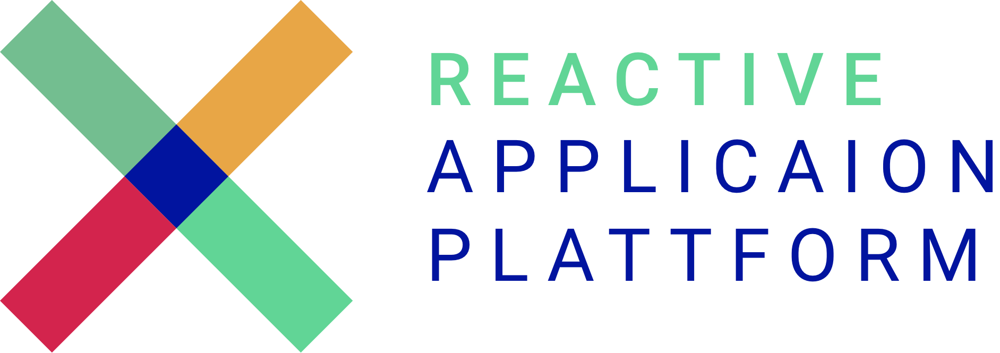

# Projects

## Angular
Name | License | Version | Dependencies | Description
--- | --- | --- | --- | ---
@rxap/material-table-window-system |  |  |  | 
@rxap/material-table-system |  |  |  | 
@rxap/material-form-system |  |  |  | 
@rxap/material-directives |  |  |  | 
@rxap/form-window-system |  |  |  | Provides the FormSystem concept for RxAP.
@rxap/contenteditable |  |  |  | 
@rxap/authentication |  |  |  | A collection of components and services to simplify the authentication process implementation.
@rxap/service-worker |  |  |  | 
@rxap/authorization |  |  |  | 
@rxap/remote-method |  |  |  | Provides the RemoteMethod concept for RxAP.
@rxap/window-system |  |  |  | 
@rxap/table-system |  |  |  | 
@rxap/data-source |  |  |  | Provides the DataSource concept for RxAP.
@rxap/environment |  |  |  | 
@rxap/form-system |  |  |  | 
@rxap/components |  |  |  | A collection of utility angular components used in RxAP.
@rxap/definition |  |  |  | Provides the Definition concept for RxAP.
@rxap/directives |  |  |  | A collection of utility angular directives used in RxAP.
@rxap/handlebars |  |  |  | 
@rxap/life-cycle |  |  |  | A utility package to execute logic after the angular app is ready
@rxap/data-grid |  |  |  | 
@rxap/socket-io |  |  |  | 
@rxap/firebase |  |  |  | A collection of utility angular services to interact with firebase.
@rxap/keycloak |  |  |  | 
@rxap/open-api |  |  |  | Provides the functionality to create DataSource and RemoteMethod instances from an OpenAPI config.
@rxap/services |  |  |  | A collection of utility angular services used in RxAP.
@rxap/config |  |  |  | Simple config file manager for angular applications.
@rxap/dialog |  |  |  | A collection of angular material dialog components
@rxap/layout |  |  |  | 
@rxap/upload |  |  |  | 
@rxap/forms |  |  |  | 
@rxap/oauth |  |  |  | 
@rxap/pipes |  |  |  | A collection of utility angular pipes used in RxAP.
@rxap/icon |  |  |  | 
@rxap/tree |  |  |  | A collection of components, data-sources and remote methods the simplify the usage of tree like components

Name | License | Version | Dependencies | Description
--- | --- | --- | --- | ---
@rxap/json-schema-to-typescript |  |  |  | Generates typescript interfaces from json schema definition.
@rxap/schematics-xml-parser |  |  |  | 
@rxap/data-structure-tree |  |  |  | 
@rxap/generator-utilities |  |  |  | 
@rxap/schematics-utilities |  |  |  | 
@rxap/generator-ts-morph |  |  |  | 
@rxap/schematics-open-api |  |  |  | 
@rxap/reflect-metadata |  |  |  | 
@rxap/plugin-utilities |  |  |  | 
@rxap/plugin-library |  |  |  | 
@rxap/xml-parser |  |  |  | A utility packages to convert xml files into class instances.
@rxap/utilities |  |  |  | A collection of utility functions, types and interfaces.
@rxap/validator |  |  |  | 
@rxap/pattern |  |  |  | 
@rxap/slugify |  |  |  | A utility to slugify a string.
@rxap/mixin |  |  |  | 
@rxap/rxjs |  |  |  | 

## NestJS
Name | License | Version | Dependencies | Description
--- | --- | --- | --- | ---
@rxap/nest-socket-io-client |  |  |  | 
@rxap/nest-utilities |  |  |  | 
@rxap/nest-firebase |  |  |  | 
@rxap/nest-logger |  |  |  | 
@rxap/nest-sentry |  |  |  | 
@rxap/nest-server |  |  |  | 
@rxap/nest-minio |  |  |  | 

## NX Schematic
Name | License | Version | Dependencies | Description
--- | --- | --- | --- | ---
@rxap/schematics-ts-morph |  |  |  | 

## NX Plugin
Name | License | Version | Dependencies | Description
--- | --- | --- | --- | ---
@rxap/plugin-build-info |  |  |  | 
@rxap/plugin-localazy |  |  |  | 
@rxap/plugin-docker |  |  |  | 

## Node
Name | License | Version | Dependencies | Description
--- | --- | --- | --- | ---
@rxap/node-utilities |  |  |  | 

